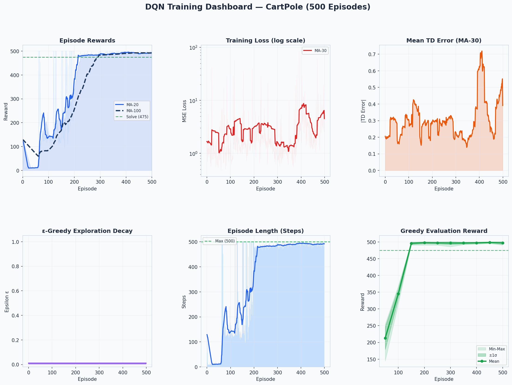
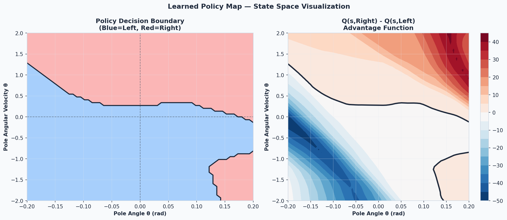
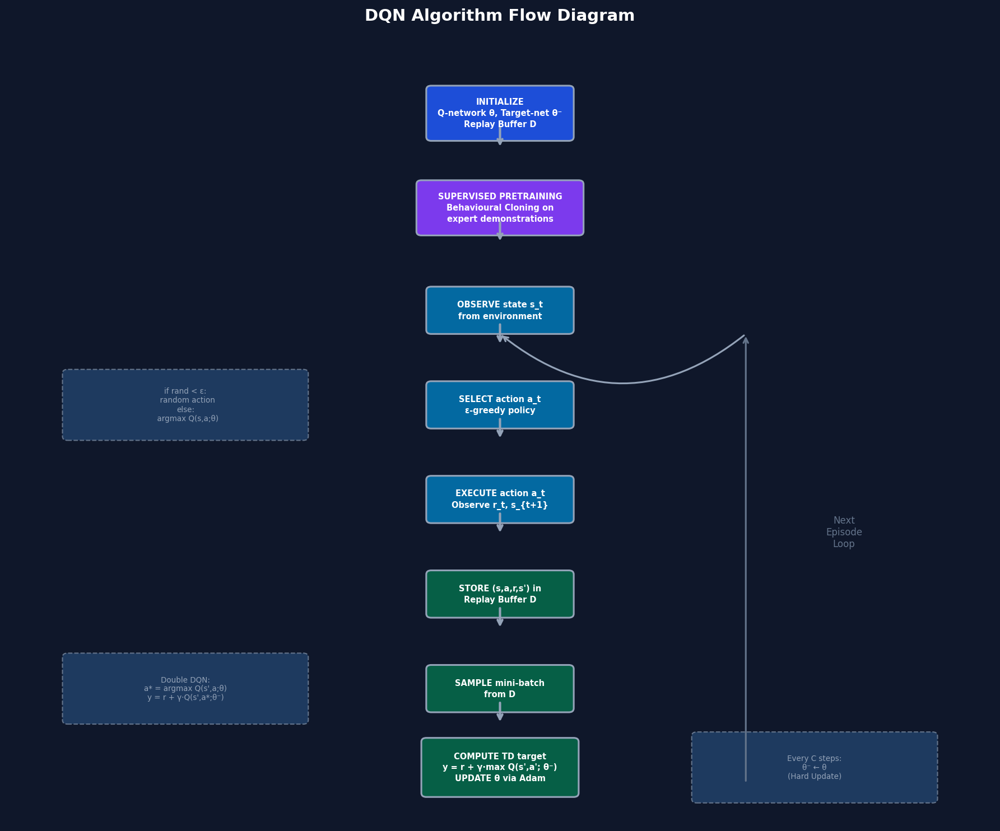

# DQN RL Project (CartPole, NumPy-Only)

[](https://python.org)
[](.)
[](.)
[](.)
[](./LICENSE)

A from-scratch Deep Q-Network implementation (environment, replay, network, and training loop) built with NumPy.

## Visual Preview








## Tags
`reinforcement-learning`, `deep-q-learning`, `cartpole`, `numpy`, `double-dqn`, `experience-replay`, `ml-project`

## Quick Start

```bash
python train.py --episodes 120
python evaluate.py --model checkpoints/best_model.pkl
jupyter nbconvert --to notebook --inplace --execute notebooks/DQN_Complete.ipynb
```

## Latest Local Run (2026-04-28)

- Training command: `python train.py --episodes 120`
- Best evaluation checkpoint: `checkpoints/best_model.pkl`
- Evaluation mean reward: `210.1 +- 30.6` over 20 episodes
- Notebook executed successfully: `notebooks/DQN_Complete.ipynb`

## Folder Guides

- [model/README.md](./model/README.md)
- [notebooks/README.md](./notebooks/README.md)
- [scripts/README.md](./scripts/README.md)
- [charts/README.md](./charts/README.md)
- [checkpoints/README.md](./checkpoints/README.md)
- [logs/README.md](./logs/README.md)
- [docs/README.md](./docs/README.md)

## Showcase

See [docs/SHOWCASE.md](./docs/SHOWCASE.md) for animations, diagrams, and visual presentation links.

## Publish

See [docs/PUBLISHING.md](./docs/PUBLISHING.md) for GitHub, Kaggle, and Hugging Face workflow commands.

## Live Showcase Page

Open `index.html` in this repository for a visual project presentation with animated sections, diagrams, tables, and chart gallery.  
For web hosting, enable GitHub Pages in repo settings and use root (`/`) on `main` branch.
